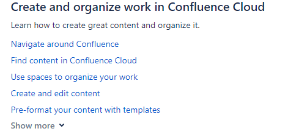

<!-- Example for normal text -->

<!-- Example for title -->
# Zalety i wady dokumentacji Confluence/Jira/Flare
Celem tego opracowania jest zaprezentowanie mocnych i słabych stron dokumentacji wskazanych powyżej narzędzi.

Pogrupowałam cechy poszczególnych dokumentacji według wybranych kategorii, aby łatwiej było je ze sobą porównać.

<!-- Here comes the TOC -->  

  - [Dokumentacja Jira i Confluence](#dokumentacja-confluence)
    - [Zalety](#zalety)
    - [Wady](#wady)
  - [Dokumentacja MadCap Flare](#dokumentacja-flare)
    - [Zalety](#zalety-2)
    - [Wady](#wady-2)
  - [Podsumowanie](#podsumowanie)
 

<!-- Example of paragraph of text -->

## Dokumentacja Jira i Confluence
Postanowiłam poddać wspólnej analizie dokumentacje systemów Jira i Confluence, gdyż zostały one opracowane w niemal identyczny sposób. Obie znajdują się na tej samej platformie w dziale Atlassian Support.

Dokumentacja systemu Jira jest dostępna na [stronie](https://support.atlassian.com/jira-software-cloud/resources/) a Confluence na pod tym [linkiem](https://support.atlassian.com/confluence-cloud/), obie w sekcji Documentation.

### Zalety
#### Dostępność
- Dokumentacja jest łatwo dostępna ze strony głównej Atlassian. Użytkownik może do niej łatwo trafić.
- Jest ona napisana prostym język (simplified English), który ma być zrozumiały dla każdego: strona czynna czasowników, krótkie zdania, forma bezpośrednia „you”.
  
#### Struktura
- W centralnym miejscu na stronie jest wyszukiwarka, która poprawnie zwraca wyszukiwane treści np. po słowie kluczowym a wyniki wyszukiwania wyświetlają się w nowym oknie.
- Dokumentacja to zbiór linków prowadzących do coraz bardziej szczegółówych treści. Ma strukturę drzewka – od ogółu przechodzi się do szczegółu.
- Po najechaniu kursorem na tytuł wyświetla się krótkie podsumowanie zawartości. 
  
 
- Wszystkie treści są zebrane w zaledwie kilka głównych sekcji, co sprawia, że użytkownik nie jest przytłoczony nadmiarem informacji. 
- U góry każdej strony jest ścieżka kategorii.
- Po lewej stronie można kliknąć na  i wyświetli się menu kontekstowe. 
- W poszczególnych rozdziałach po prawej stronie są linki do powiązanych treści.

#### Interfejs
- Bardzo prosty, wręcz minimalistyczny, przejrzysty i spójny interfejs (jedynie kilka kolorów na białym tle)
- Nagłówki są napisane większą czcionką, a pod spodem jest krótka informacja na temat zawartości sekcji, co zapewnia większą czytelność i szybsze dotarcie do poszukiwanych treści.
- Na głównym ekranie w każdej sekcji znajduje się tylko 5 linków. Resztę można podejrzeć po kliknięciu w Show more, co znów sprawia, że nie jest wyświetlanych za dużo informacji na raz.

- Czytelna kategoryzacja treści – stosowane są listy numerowane, wypunktowane, krótkie akapity. Treści z aplikacji są **wytłuszczone** lub napisane *kursywą*. Stosowane są screeny, tabelki z elementami graficznymi. 
   

- Stosowane są 3 rodzaje wiadomości kontekstowych, zwracających szczególną uwagę użytkownika na pewne aspekty funkcjonalności (w celu informacyjnym, ostrzegawczym i uszczegóławiającym). 
  
 

#### Aktualizacje
- Można podejrzeć poprzednią wersję dokumentacji danej funkcjonalności, jeśli zostały w niej wprowadzone zmiany. 
  

- Na każdej stronie jest informacja o tym, kiedy ją ostatnio aktualizowano. 
  

#### Informacje zwrotne
- Pod koniec każdej sekcji jest pytanie o przydatność treści dla użytkownika i miejsce na udzielenie feedbacku. 
  

- Jest również link do forum Społeczności, na którym można zadać dodatkowe pytania lub rozpocząć dyskusję.

### Wady
#### Dostępność
- Dokumentacja jest dostępna wyłącznie w języku angielskim. Nie zauważyłam, by było dostępne tłumaczenie na inne języki lub by była możliwość tłumaczenia maszynowego poprzez wbudowany silnik.
- Brak materiałów interaktywnych, jak choćby krótkich filmików wideo.
- Brak możliwości pobrania treści w formacie pdf czy wydruku bezpośrednio ze strony.
#### Struktura
- Stronę startową trzeba dość sporo scrollować, aby zobaczyć, co znajduje się na dole (dotyczy to zwłaszcza dokumentacji systemu Jira). Można by było skondensować treści, by się wyświetlały bez konieczności scrollowania (np. poprzez prezentację w formie ikonek lub podział na mniejsze sekcje). Byłaby to taka strona wprowadzająca do bardziej szczegółowych treści. 
- Podstrony również wymagają scrollowania. Jest co prawda klikalny spis treści, ale znajduje się on po prawej stronie, poniżej powiązanych treści i nie rzuca się w oczy. Powinien on być umiejscowiony w bardziej widocznym miejscu.
#### Interfejs
- Dla jednych prosty interfejs to zaleta, ale dla innych może być wadą. Może warto by było wprowadzić więcej elementów graficznych na stronie, np. podział sekcji na kolorowe kafelki (klikalne) czy więcej ikonek. Co prawda pojawia się 9 bloków tematycznych ale dopiero po kliknięciu na Documentation (w górnym menu). Może to nie być zbyt intuicyjne dla użytkownika.
#### Aktualizacje
- Nie znalazłam nigdzie osobnej sekcji What's new czy Release notes, czyli podsumowania ostatnio wdrożonych zmian i nowości.

## Dokumentacja MadCap Flare
Dokumentacja jest dostępna w dziale [Support](https://www.madcapsoftware.com/support/) i jest bardzo rozbudowana. Do analizy wykorzystałam sekcję [Online Help](https://help.madcapsoftware.com/flare2021r2/Content/Flare/Introduction/Home.htm).

### Zalety
#### Dostępność
- Dokumentacja jest łatwo dostępna ze strony głównej produktu.
- Istnieje możliwość wydruku treści czy zapisania *User Guide* i *Tutoriala* w formie pliku pdf.
- Dostępne są treści video: krótkie instruktażowe filmiki bezpośrednio przy opisie danej fukncjonalności.

- Używany jest prosty język (simplified English) zrozumiały dla każdego: strona czynna czasowników, krótkie zdania, forma bezpośrednia „you”.
- Łatwy dostęp do dodatkowych informacji o oprogramowaniu: bloga, webinarów, społeczności,  Troubleshooting.
#### Struktura
- Duża wyszukiwarka jako kluczowa funkcjonalność na stronie; mała wyszukiwarka jest dostępna na każdej podstronie. Poprawnie zwracaja wyniki wyszukiwania, np. po słowie kluczowym, ale w tym samym oknie. Ciekawe jest to, że jeśli do danego słowa jest dostepny filmik, to otwiera się on automatycznie wraz z wynikami wyszukiwania.
- Dobrze zbudowana strona startowa produktu MadCap Flare – zaledwie kilka rozdziałów, zwrócenie uwagi na podstawy, filmiki instruktażowe
- Rozwijany panel boczny: spis treści zawierający opis poszczególnych funkcjonalności pogrupowanych w kategorie - struktura drzewka.

- Zamieszczone są linki prowadzące do materiałów referencyjnych.
- Istnieje możliwość łatwego powrotu na górę strony.
- W przypadku bardziej rozbudowanych rozdziałów są specjalne strony startowe z odnośnikami do bardziej szczegółowych treści.

#### Interfejs
- Teksty napisane są dość dużymi literami i czytelną czcionką, co jest korzystne dla osób mających problemy z widzeniem. Treści mają wyraźne nagłówki. Stosowane jest również **pogrubienie**.
- Przy opisie niektórych funkcjonalności zamieszczono screeny z możliwością ich powiększenia.

- Design jest ascetyczny z niewielką liczbą kolorów, ale nie sprawia wrażenia smutnego.
- Istotne treści i przykłady są wyróżnione w formie kolorowego obramowania.
- Informacje dla specjalnych grup są specjalnie oznaczone, np. *Information for developers* (na czerwonym tle).

#### Aktualizacje
- Na stronie startowej znajduje się sekcja *What’s new* przedstawiająca podsumowanie ostatnio wdrożonych zmian i nowości wraz z filmikiem.

### Wady
#### Dostępność
- Dokumentacja jest dostępna wyłącznie w języku angielskim. Nie zauważyłam, by było dostępne tłumaczenie na inne języki lub by była możliwość tłumaczenia maszynowego poprzez wbudowany silnik. 
- Brak napisów na filmikach; ponadto lektor mówi bardzo szybko, co może utrudnić użytkownikowi zrozumienie treści.
#### Struktura
- Wyniki wyszukiwania otwierają się w tym samym oknie. Lepszą funkcjonalnością jest ich otwieranie w osobnym oknie.
#### Interfejs
- W niektórych rozdziałach brakuje przestrzeni w tekście, przez co trudniej dotrzeć do tego, czego się poszukuje. Te bloki tekstu powodują, ze trzeba je przeczytać w całości, a nie wystarczy jedynie przejrzeć.
#### Aktualizacje
- Brak informacji na stronie głównej i podstronach o tym, kiedy je ostatnio aktualizowano.
#### Informacje zwrotne
- Brak możliwości wyrażenia feedbacku o treściach zamieszczonych w dokumentacji.

## Podsumowanie
Na podstawie wskazanej powyżej analizy chciałabym zaprezentować ocenę własną głównych cech dokumentacji systemów Jira/Confluence i Flare:

| Kategoria           | Dostępność       | Struktura          | Interfejs         |  Aktualizacje         | Informacje zwrotne         | 
| ---------------- | ---------------- | ---------------- | ---------------- | ---------------- | ---------------- |  
| Jira/Confluence   | oo   | oo   | oo   | ooo   | ooo   | 
| Flare  | ooo | ooo | oo | o | -- | 

ooo - bardzo dobrze rozwinięte 

oo - wymaga niewielkiej poprawy 

o - sugerowane jest wprowadzenie zmian

-- - brak funkcjonalności

