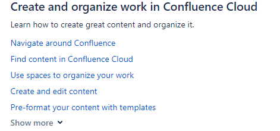
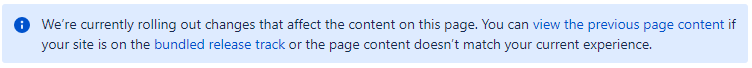
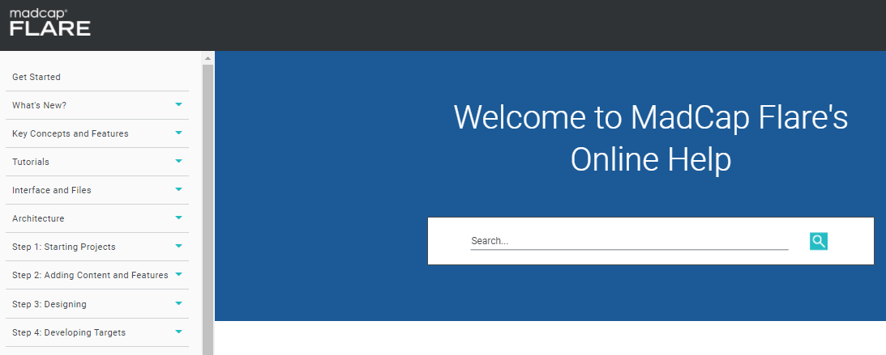
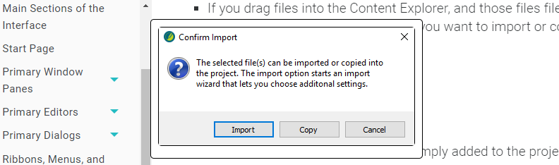
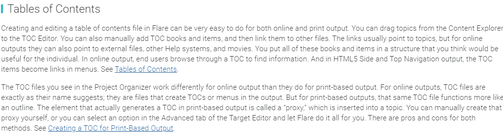

# Strengths and weaknesses of Confluence/Jira/MadCap Flare systems
This paper aims to present strenghts and weaknesses of the documentation available for the above-mentioned tools.

I have categorised features of particular documents so that it was easy to compare them.
 

  - [Dokumentation of Jira and Confluence](#dokumentation-of-jira-and-confluence)
    - [Strengths](#strengths)
      - [Availability](#availability)
      - [Structure](#structure)
      - [Interface](#interface)
      - [Updates](#updates)
      - [Feedback](#feedback)
    - [Weaknesses](#weaknesses)
      - [Availability](#availability-1)
      - [Structure](#structure-1)
      - [Interface](#interface-1)
      - [Updates](#updates-1)
  - [MadCap Flare documentation](#madcap-flare-documentation)
    - [Strengths](#strengths-1)
      - [Availability](#availability-2)
      - [Structure](#structure-2)
      - [Interface](#interface-2)
      - [Updates](#updates-2)
    - [Weaknesses](#weaknesses-1)
      - [Availability](#availability-3)
      - [Structure](#structure-3)
      - [Interface](#interface-3)
      - [Updates](#updates-3)
      - [Feedback](#feedback-1)
  - [Summary](#summary)
 

## Dokumentation of Jira and Confluence
I have decided to analyse Jira and Confluence together, because they were drafted in an almost identical way. Both can be found on the same platform in Atlassian Support.

The Jira documentation is available at this [page](https://support.atlassian.com/jira-software-cloud/resources/) and the one for Confluence under this [link](https://support.atlassian.com/confluence-cloud/resources), both in the *Documentation* section.

### Strengths
#### Availability
- The documentation is easily accessible from the Atlassian homepage. A user can find it quickly.
- It is written in plain language (*Simplified Technical English*) understandable for everyone: active form of verbs short sentences, direct "you" form.
  
#### Structure
- In the central place on the page we can see a searcher that correctly shows search results e.g. by keywords in a separate window.
- The documentation consists of numerous links leading to more more precise contents. It has a tree structure going from general to detail.
- After hovering the mouse over the title, a short section summary is displayed.
  
 
- All contents are grouped in only few main sections, as a result of which the user is not overwhemed by too much information.
- On top of each page there is a category tree.
- On the left you can click on  and a context menu will be displayed. 
- In particular sections on the right there are cross-reference links.

#### Interface
- The documentation has very simple, minimalistic and coherent interface (only several colours against a white background).
- Headers are written in a bigger font with short information on what the section contains underneath, which makes it more clear for the user who can access the searched texts more quickly.
- Each section on the main screen contains only 5 links. The rest can be seen after clicking on *Show more*, which again follows the rule for not displaying too much information at a time.

- Clear content structure: there are numbered lists, bullet points, short paragraphs. For better clarity some contents are written in **bold** or *italic*. A user can also come across screenshots and tables with graphical elements. 
   

- Throughout the documentaton 3 types of context messages are used, which makes the user pay special attention to certain aspects of a given functionality (information, warning and specification) 
  
 

#### Updates
- It is possible to read the previous version of documentation for a particular feature if any changes have been made to it. 
  

- Each page contains brief information on the date when it was last updated. 
  

#### Feedback
- At the end of each section a user can answer a question if the content was helpful and provide feedback. 
  

- There is also a link to the [Community](https://community.atlassian.com/t5/custom/page/page-id/create-post-step-1?add-tags=confluence,Cloud&from-cac=true) page where it is possible to ask additional questions and start or join a discussion.

### Weaknesses
#### Availability
- The documentation is available only in English. I have not noticed translation available into any other language or that machine translation was possible through an embedded engine.
- There are no (or very few) interactive materials such as short videos.
- It is not possible to download contents as a pdf file or print the document directly from the page in a printer-friendly format.
#### Structure
- In some cases the homepage needs to be scrolled a lot to see what is at the end (it concerns mostly Jira documentation). It would be recommended to make the contents more concise so that they were shown without the need to scroll the page (e.g. by presenting them in the form of links or icons, or divide them into smaller sections). I would recommend developing some more intro pages. 
- Subpages also require scrolling ([example](https://support.atlassian.com/jira-software-cloud/docs/advanced-search-reference-jql-fields/)). Even though they contain a clickable table of contents, it is displayed on the right below references and is not easy to spot. However, it should be found in a more visible place.

#### Interface
- For some a simple interface is an advantage, for others it can be the opposite. Maybe it would be good to introduce more graphical elements on some pages, such as colorful tiles. Although there are a few themes which group content, but only after clicking on *Documentation* (in top menu). I am afraid it is not very intuitive for a user.
- There is an option to return to top of the page, however, in case of lengthy sessions, it is not clearly visible.
#### Updates
- I have not found separate *What's new* or *Release notes* sections containing a summary of changes made recently and new features introduced with the latest upgrade.

## MadCap Flare documentation
The documentation is available in the [Support](https://www.madcapsoftware.com/support/) section and is well developed. For my analysis I have used [Online Help](https://help.madcapsoftware.com/flare2021r2/Content/Flare/Introduction/Home.htm).

### Strengths
#### Availability
- The documentation is easily accessible from the product's homepage.
- It is possible to print the contents or save the *User Guide* and the *Tutorial* as a pdf file.
- Users can watch numerous short videos directly next to descriptions of particular features.

- It is written in plain language (*Simplified Technical English*) understandable for everyone: active form of verbs short sentences, direct "you" form.
- Users can easily access additional information on the software such as a blog, webinars, Community, Troubleshooting.
#### Structure
- A big searcher is the key feature on the homepage with a small searcher available on each subpage. They both show search results correctly e.g. by keywords but in the same window. What is interesting is that if there is a video for a certain feature, it opens automatically with search results.
- The MadCap Flare's [homepage](https://help.madcapsoftware.com/flare2021r2/Content/Flare/Introduction/Home.htm) is well developed; it contains only a few sections with specific focus on basic features and training videos.
- There is a drop-down side menu with the table of contents listing a description of particular features categorised in a tree structure.

- There are numerous cross-reference links.
- A user can easily return to top of the page if lengthy sections require scrolling.
- For more detailed sections there are special intro pages with links to more precise content ([example](https://help.madcapsoftware.com/flare2021r2/Content/Flare/Translation-Localization/Translation-Localization.htm)).
- It is not necessary to scroll pages a lot: sections are short and if there are more contents, they contain links directing to more specific descriptions.

#### Interface
- Texts are written in big letters with a clear font, which is advantageous for visually-impaired persons. There are also clear headers with important elements in **bold**.
- Next to descriptions of some features there are screenshots which can be zoomed in and out.

- The design is ascetic with only a few colours, but it does not seem sad.
- Important contents and examples are featured with colourful frames.
- Information for special groups are marked differently, e.g. *Information for developers* (on the red background).

#### Updates
- On the homepage there is a [What’s new](https://help.madcapsoftware.com/flare2021r2/Content/Flare/Introduction/Whats-New/Whats-New.htm) section presenting a summary of last changes and new features with a video.

### Weaknesses
#### Availability
- The documentation is available only in English. I have not noticed translation available into any other language or that machine translation was possible through an embedded engine. 
- There are no subtitles in videos. Moreover, the voice-over is fast, which can make it difficult for the user to understand what is being said.
#### Structure
- Search results open in the same window. It would be better if they were displayed in a separate window.
#### Interface
- In some sections there is not much space in the text, as a result of which it is more difficult to access what is being searched. These text blocks require the user to read them in whole and not only browse through them for specific information.

- In my opinion the context menu on the left should rather be on the white background so that it was more clear for visually-impaired persons.

#### Updates
- There is no information on the homepage or particular pages on when they were last updated.
#### Feedback
- It is not possible to provide feedback on the documentation.

## Summary
On the basis of the above analysis I would like to present my evaluation of the main features of documentation available for Jira/Confluence and MadCap Flare:

| System/Category           | Availability      | Structure          | Interface         |  Updates         | Feedback         | 
| ---------------- | ---------------- | ---------------- | ---------------- | ---------------- | ---------------- |  
| Jira/Confluence   | oo   | oo   | oo   | ooo   | ooo   | 
| Flare  | ooo | ooo | oo | o | -- | 

ooo - very good

oo - requiring some small changes

o - more modifications should be made

-- - no such feature

